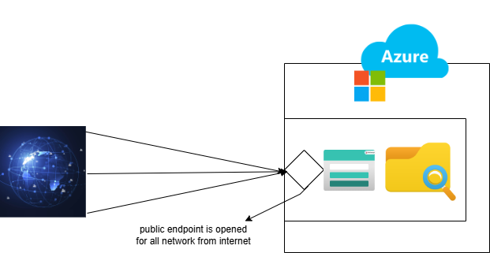

Azure file share

In today's fast-paced tech landscape, where security challenges are more pressing than ever, sensitive document storage demands innovative solutions. Azure File Share stands out as a managed file service that ensures secure and centralized access to your data. By leveraging its integration with private endpoints, Azure File Share enables access to your storage account within your secure network, eliminating exposure to public internet traffic and reinforcing high-level security. It's a game-changer for organizations seeking scalable, reliable, and secure file management systems.

Before configuring private end point and site-to-site VPN

# **point-to-site connectivity & Azure File Share Backup**  
 
This project demonstrates a **hybrid network setup** integrating an **Azure Virtual Network (AzureVnet)** with client machine using **VPN Gateway**. Additionally, it is configured with Azuer file share backup through recovery service valult to protect data from accidental and malicious deletion*.  

## **Architecture & Key Components**  
🔹 **Hybrid Connectivity** (AzureVnet ↔ client machine via VPN Gateway)  
🔹 **Azure Private Endpoint** (Securing access to Storage)  
🔹 **Azure Firewall & NSGs** (Network Security)  
🔹 **Azure File Share** (Storage solution)  
🔹 **Azure Backup Service** (Data protection)  

## **How It Works**  
1️⃣ **Hybrid Network:**  
   - A **VPN Gateway** connects client machine to AzureVnet.  
   - **Azure Firewall & NSGs** enforce secure traffic rules.  

2️⃣ **Secure Storage Access:**  
   - **Private Endpoint** restricts storage access within the VNet.  
   - **NSG Rules** control inbound/outbound storage traffic.  

3️⃣ **Backup & Security:**  
   - **Azure Backup** schedules file share backups.   
   - **Recovery Services Vault** retains backup snapshots.  

## **Diagram Explanation**  

 
The diagram illustrates the **end-to-end workflow**, showing:  
✅ Hybrid VPN connection setup  
✅ Private Endpoint linking storage securely  
✅ Azure Firewall controlling traffic flow  

## **Why This Matters?**  
✔ **Secure hybrid connectivity** for seamless cloud integration  
✔ **Data protection** with encrypted backups  
✔ **Scalable & automated** storage solution  
✔ **Enterprise-grade security** with Azure services  
